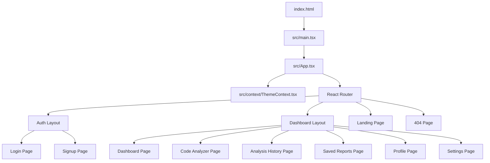

# Implementation Plan - CodeSage AI Frontend Foundation

We will build the frontend foundation for **CodeSage AI**, a premium, developer-focused AI-powered code review and debugging platform. The design will be inspired by Vercel, Linear, Cursor, and GitHub: dark-first, clean borders, high-contrast text, generous whitespace, subtle animations, and JetBrains Mono code rendering.

---

## User Review Required

> [!IMPORTANT]
> - **Tailwind CSS v4 Configuration**: We will integrate Tailwind CSS v4 in `vite.config.ts` using `@tailwindcss/vite` and configure the theme using CSS-first variables in `src/index.css` (e.g. customized dark variables, font family declarations).
> - **Auth Layout & Clerk**: As requested, we will skip actual Clerk client SDK integration for now (deferred to Prompt 2). We will build custom Login and Signup pages and a User Menu component using beautiful static states so they are functional to navigate.
> - **Monaco Editor Placeholder**: A custom text area styled like a rich editor with line numbers, code highlighting syntax, and language selection will be implemented, preparing the UI for Monaco Editor integration in a later step.

---

## Proposed Changes

We will restructure the client project to support a highly organized and scalable architecture.

### 1. Build System & Styling Setup

#### [MODIFY] [vite.config.ts](file:///c:/Users/gulsh/Downloads/codesageai/client/vite.config.ts)
- Add `@tailwindcss/vite` plugin to enable Tailwind CSS v4 processing.

#### [MODIFY] [index.html](file:///c:/Users/gulsh/Downloads/codesageai/client/index.html)
- Add Google Fonts link for **Plus Jakarta Sans** (sans UI font) and **JetBrains Mono** (monospaced code font).
- Update the page title to `"CodeSage AI — AI-Powered Code Review & Debugging"`.

#### [MODIFY] [index.css](file:///c:/Users/gulsh/Downloads/codesageai/client/src/index.css)
- Import Tailwind CSS: `@import "tailwindcss";`.
- Set up custom theme variables using `@theme` syntax for Tailwind v4.
- Configure dark-first global scrollbars, selection styling, and typography defaults.

#### [DELETE] [App.css](file:///c:/Users/gulsh/Downloads/codesageai/client/src/App.css)
- Remove unused boilerplate CSS file.

---

### 2. Context & Theme Management

#### [NEW] [ThemeContext.tsx](file:///c:/Users/gulsh/Downloads/codesageai/client/src/context/ThemeContext.tsx)
- Implement `ThemeContext` and `ThemeProvider` to handle toggling between `dark` and `light` mode.
- Default to `dark` theme (dark-first).
- Sync the selected theme to `localStorage` and toggle the `.dark` class on the `html` element.

---

### 3. Reusable UI Components

We will create core UI primitives inside `src/components/ui/` and layout shell parts in `src/components/layout/`.

#### [NEW] [Button.tsx](file:///c:/Users/gulsh/Downloads/codesageai/client/src/components/ui/Button.tsx)
- Reusable button component with support for `primary`, `secondary`, `outline`, `ghost`, and `danger` variants.
- Animated using `framer-motion` for micro-interactions (subtle hover scale, active tap).

#### [NEW] [Card.tsx](file:///c:/Users/gulsh/Downloads/codesageai/client/src/components/ui/Card.tsx)
- Card container component supporting hover states, border highlights, and padding configurations.

#### [NEW] [Badge.tsx](file:///c:/Users/gulsh/Downloads/codesageai/client/src/components/ui/Badge.tsx)
- Badge indicator supporting language chips (e.g. Python, TS, Go) and status categories (e.g. Info, Warning, Error, Success).

#### [NEW] [Spinner.tsx](file:///c:/Users/gulsh/Downloads/codesageai/client/src/components/ui/Spinner.tsx)
- Sleek CSS spinner with customizable sizes.

#### [NEW] [ThemeToggle.tsx](file:///c:/Users/gulsh/Downloads/codesageai/client/src/components/layout/ThemeToggle.tsx)
- Icon toggle switch (Sun/Moon) using Lucide icons.

#### [NEW] [SearchBar.tsx](file:///c:/Users/gulsh/Downloads/codesageai/client/src/components/layout/SearchBar.tsx)
- An search input with shortcuts styled like Raycast/Vercel filter bars.

#### [NEW] [UserMenu.tsx](file:///c:/Users/gulsh/Downloads/codesageai/client/src/components/layout/UserMenu.tsx)
- Sleek dropdown menu presenting user credentials, profile navigation, and sign-out buttons.

#### [NEW] [Navbar.tsx](file:///c:/Users/gulsh/Downloads/codesageai/client/src/components/layout/Navbar.tsx)
- Sticky top navbar for the landing page.

#### [NEW] [Sidebar.tsx](file:///c:/Users/gulsh/Downloads/codesageai/client/src/components/layout/Sidebar.tsx)
- Sidebar for the dashboard layout containing navigation items and user details.

#### [NEW] [Footer.tsx](file:///c:/Users/gulsh/Downloads/codesageai/client/src/components/layout/Footer.tsx)
- Grid layout footer for the landing page with categories.

#### [NEW] [MobileNav.tsx](file:///c:/Users/gulsh/Downloads/codesageai/client/src/components/layout/MobileNav.tsx)
- Drawer overlay menu for mobile sizes.

#### [NEW] [EmptyState.tsx](file:///c:/Users/gulsh/Downloads/codesageai/client/src/components/shared/EmptyState.tsx)
- Presentational placeholder for empty dashboards, histories, or search filters.

#### [NEW] [ErrorState.tsx](file:///c:/Users/gulsh/Downloads/codesageai/client/src/components/shared/ErrorState.tsx)
- Card indicating component loading failure or search error states.

---

### 4. Layouts

We will create two main layouts inside `src/layouts/`.

#### [NEW] [DashboardLayout.tsx](file:///c:/Users/gulsh/Downloads/codesageai/client/src/layouts/DashboardLayout.tsx)
- Layout for logged-in states containing `Sidebar`, desktop header with `SearchBar`, `ThemeToggle`, `UserMenu`, and responsive rendering for mobile (collapsible sidebar / drawer).

#### [NEW] [AuthLayout.tsx](file:///c:/Users/gulsh/Downloads/codesageai/client/src/layouts/AuthLayout.tsx)
- Sleek form layout for authentication pages.

---

### 5. Pages

#### [NEW] [LandingPage.tsx](file:///c:/Users/gulsh/Downloads/codesageai/client/src/pages/landing/LandingPage.tsx)
A beautiful multi-section marketing page incorporating:
- **Hero Section**: Strong developer messaging, live preview of code analysis, quick interactive sample.
- **Features Section**: Bento-grid or card layout illustrating bug detection, performance audits, security.
- **How It Works**: Modern step-by-step pipeline from upload to review.
- **Supported Languages**: Styled icon chips.
- **Testimonials**: Clean quotes with GitHub credentials.
- **Pricing**: SaaS billing details (highlights Free plan).
- **FAQ**: State-based interactive accordions.
- **CTA**: Email input / signup trigger.

#### [NEW] [LoginPage.tsx](file:///c:/Users/gulsh/Downloads/codesageai/client/src/pages/auth/LoginPage.tsx)
- Email & password form with basic validation. Option for Github/Google mock OAuth.

#### [NEW] [SignupPage.tsx](file:///c:/Users/gulsh/Downloads/codesageai/client/src/pages/auth/SignupPage.tsx)
- Creation form with password confirmation.

#### [NEW] [DashboardPage.tsx](file:///c:/Users/gulsh/Downloads/codesageai/client/src/pages/dashboard/DashboardPage.tsx)
- Display overall metrics (analyses run, issues found, language split, health score) and list of recent reviews.

#### [NEW] [CodeAnalyzerPage.tsx](file:///c:/Users/gulsh/Downloads/codesageai/client/src/pages/analyzer/CodeAnalyzerPage.tsx)
- Developer work environment: Code input text-area, language selector, and mock reviewer run action.
- Displays an interactive code analysis report detailing security flaws, optimizations, and refactored code comparison.

#### [NEW] [AnalysisHistoryPage.tsx](file:///c:/Users/gulsh/Downloads/codesageai/client/src/pages/history/AnalysisHistoryPage.tsx)
- Table listing past analyses with metrics, filtering, and sort functionality.

#### [NEW] [SavedReportsPage.tsx](file:///c:/Users/gulsh/Downloads/codesageai/client/src/pages/reports/SavedReportsPage.tsx)
- Saved/starred reviews for quick lookups.

#### [NEW] [ProfilePage.tsx](file:///c:/Users/gulsh/Downloads/codesageai/client/src/pages/profile/ProfilePage.tsx)
- Developer card containing statistics, recent achievements, and account details.

#### [NEW] [SettingsPage.tsx](file:///c:/Users/gulsh/Downloads/codesageai/client/src/pages/settings/SettingsPage.tsx)
- Config tabs for preferences, AI settings, and integration mockups.

#### [NEW] [NotFoundPage.tsx](file:///c:/Users/gulsh/Downloads/codesageai/client/src/pages/NotFoundPage.tsx)
- Sleek 404 screen with terminal-like text and redirection CTA.

---

### 6. App Configuration & Routing

#### [MODIFY] [App.tsx](file:///c:/Users/gulsh/Downloads/codesageai/client/src/App.tsx)
- Configure the `routes` definition using `react-router-dom` standard routing hooks/components.
- Integrate the `ThemeProvider` and react-query client.

---

## Verification Plan

### Automated Tests
- Run `npm run build` to confirm compiling issues, linting, and bundler configurations.
- Verify TypeScript types are clean with `npx tsc --noEmit`.

### Manual Verification
- Launch the development server `npm run dev` and navigate through all routes:
  - Verify styling across sizes (responsive mobile navigation check).
  - Verify theme state (persisted when switching pages or refreshing).
  - Verify code analysis run (shows loader, yields mock report).
